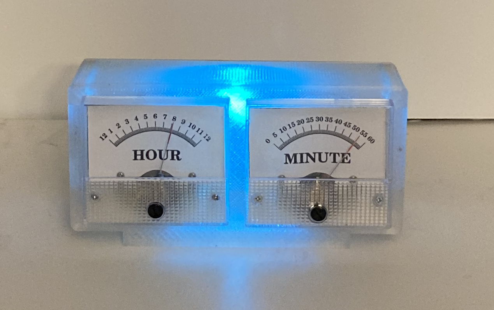
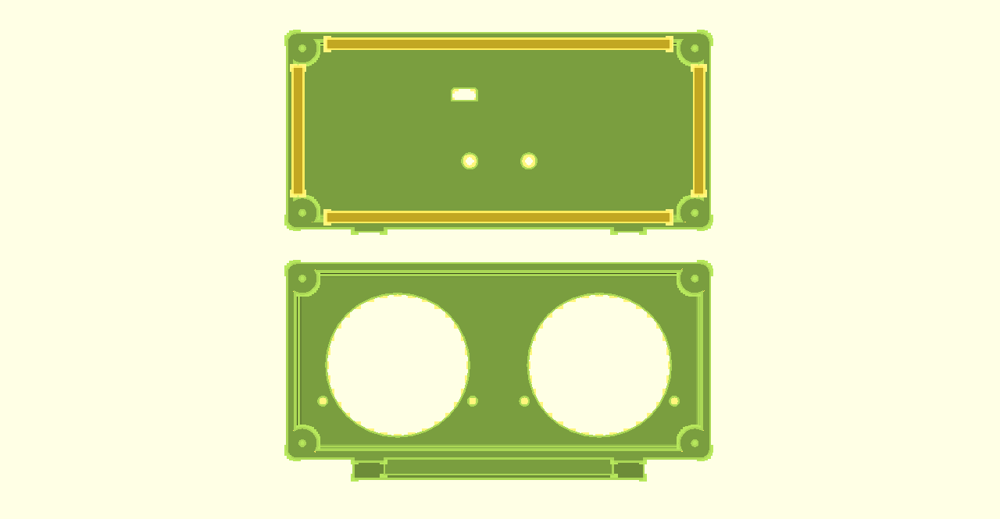
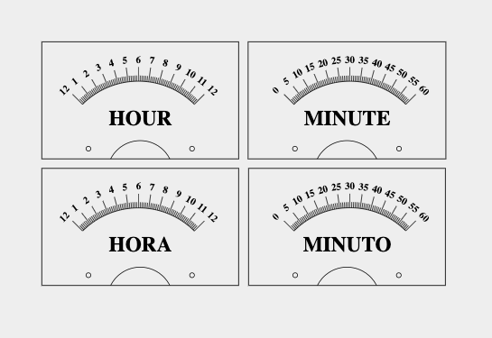
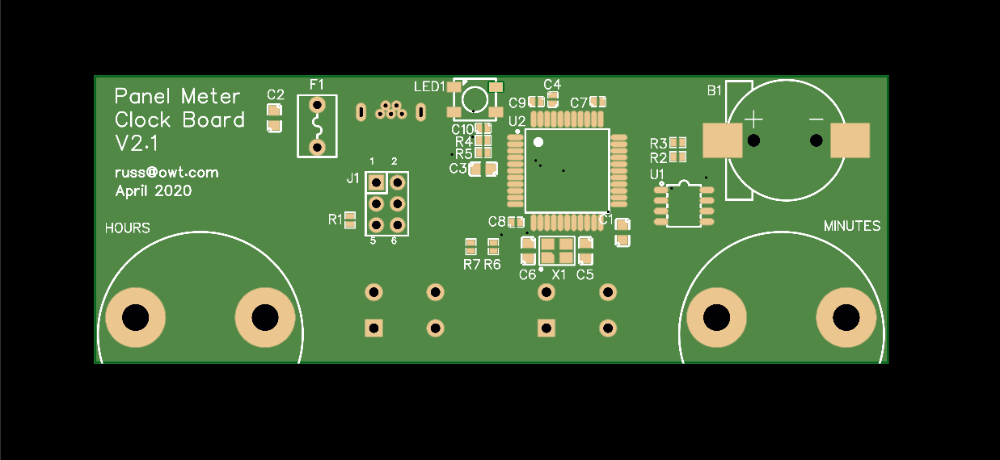

Panel Meter Clock V2.1
----------------------
My father has been a lifelong Ham Radio Operator with a fondness for anything
with a panel meter. After seeing the [“Trinket Powered Analog Meter
Clock”](<https://learn.adafruit.com/trinket-powered-analog-meter-clock>) by
Mike and Anne Barela on the Adafruit website I knew I had to make one like it
to give to my Dad for his 80th birthday.

Here is Version 2.1 of that clock.

3D Printed Case
---------------
All parts print without support. I have printed them with 0.3mm or
0.2mm layer heights using 3 top, bottom and perimeter shells in PLA.

Meter Faces
-----------
The Hour and Minute meter scales were created using Inkscape. The source SVG
file is provided in case you wish to make changes, as well as 300 and 600dpi
PDF files that can be printed at 100% scale.

PC Board
--------
I designed a custom Arduino Leonardo compatible P.C. board with a DS321 RTC
clock, NeoPixel and USB connector that mounts directly to the back of the two
panel meters.

Additional Information
----------------------

[Assembly Video](https://youtu.be/PN79dx3BKjI)

[Assembly Instructions](http://penfold.owt.com/panel_meter_clock_v2.1)

[GitHub Repo](https://github.com/russhughes/panel_meter_clock)

Additional Arduino Libraries
----------------------------

- [Adafruit RTClib](https://github.com/adafruit/RTClib)
- [Adafruit NeoPixel](https://github.com/adafruit/Adafruit_NeoPixel)
